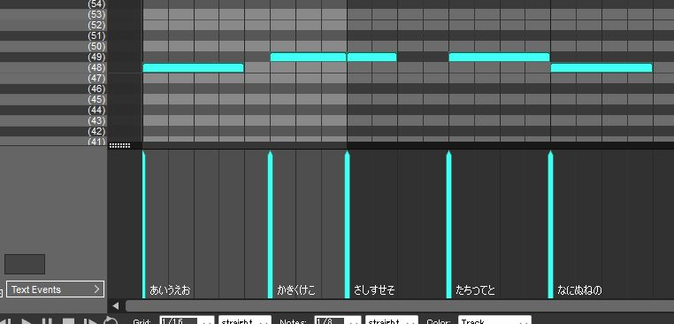

# Tunecore MIDI Lyrics

Tunecoreの歌詞登録の行同期をMIDIファイルから行えるようにするUserscript。

## インストール

1. [Tampermonkey](https://www.tampermonkey.net/)などのUserscriptマネージャーをインストールします。
2. [ここ](https://raw.githubusercontent.com/sevenc-nanashi/tunecore-midi-lyrics/built/tunecore-midi-lyrics.user.js) からUserscriptをインストールします。

## 使い方

1. Tunecoreのリリース編集ページを開きます。
2. 「歌詞未設定」または「歌詞設定済み」ボタンを押し、「行同期」を選択します。
3. 「MIDIを開く」ボタンをクリックします。

### MIDIファイルの制約・仕様



<a name="midi-spec"></a>

- MIDIのノートイベントとテキストイベントを使用します。
- MIDI内のトラックは無視され、一つのトラックとして処理されます。
- ノートが重なってはいけません。
- ノートとテキストイベントは1:1で対応している必要があります。
  - ノートに対応するテキストイベントが存在しない場合、読み込みに失敗します。
  - テキストイベントに対応するノートが存在しない場合、読み込みに失敗します。
- ノート間に空白がある場合、空行が挿入されます。
- 音階が異なる場合、間に空行が挿入されます。
  - これはデュエット曲などで片方が歌った状態のままもう片方がサビを歌い始める場合などに使えます。

## 開発

[mise](https://mise.jdx.dev/)が必要です。

```bash
mise install
bun install
```

開発サーバーを起動するには、以下のコマンドを実行します。

```bash
bun run dev
```

## ライセンス

MIT Licenseで提供されています。詳細は[LICENSE](./LICENSE)ファイルをご覧ください。
